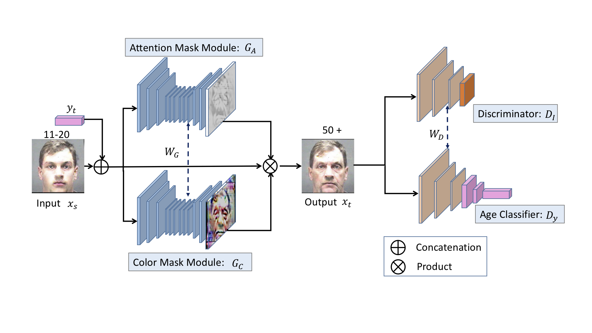

## Look globally, age locally: Face aging with an attention mechanism (AcGANs)

PyTorch implementation of the AcGANs algorithm. 

### 1. The Architecture of AcGANs

---




### 2.Prerequisites

----


* Python 3.6

* PyTorch 1.3.0
* GPU

### Dataset & Preparation

------


* [Morph](https://ebill.uncw.edu/C20231_ustores/web/classic/product_detail.jsp?PRODUCTID=8)
* [CACD](http://bcsiriuschen.github.io/CARC/_)

### Training

----


Training a model by:

```
$ python main.py config/morph.yml
```

### Results

-----


* Attention Results
* 

* Results on the Morph Dataset

* 

* Comparison of AcGANs, IPCGANs, and CAAE in the Morph Dataset

  

  

### Citation

-----


### License

------


**AcGANs** is freely available for free non-commercial use, and may be redistributed under these conditions. For commercial queries, contact [Junping Zhang](http://www.pami.fudan.edu.cn/~jpzhang/).